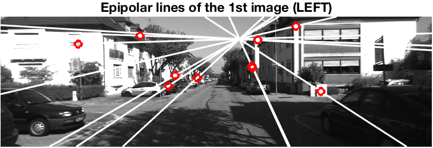
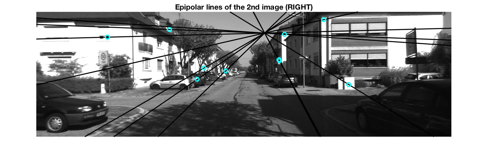

# 8-point-algorithm-MATLAB

## Code Structure

### eightPoint.m
Normalized 8-point algorithm implemented in MATLAB

	Usage: F = eightPoint(p, q, K1, K2)
		where:
			p - coordinates of matched points in the first image
			q - coordinates of matched points in the second image
			K1 - intrinsic matrix of the camera corresponding to the first view
			K2 - intrinsic matrix for the second view
	  
### test_synth
Test of normalized 8-point algorithm in MATLAB

### test_epilines
Test of normalized 8-point algorithm on images from KITTI sequence. Epipolar lines of the given image pair will be overlayed onto the images. Below is an example.

